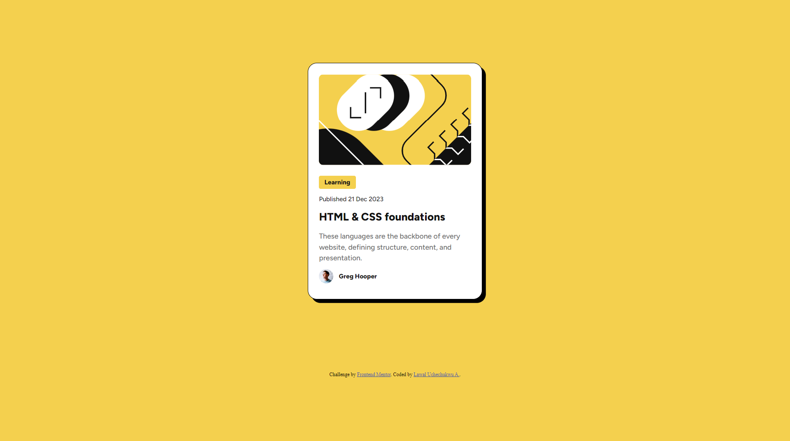
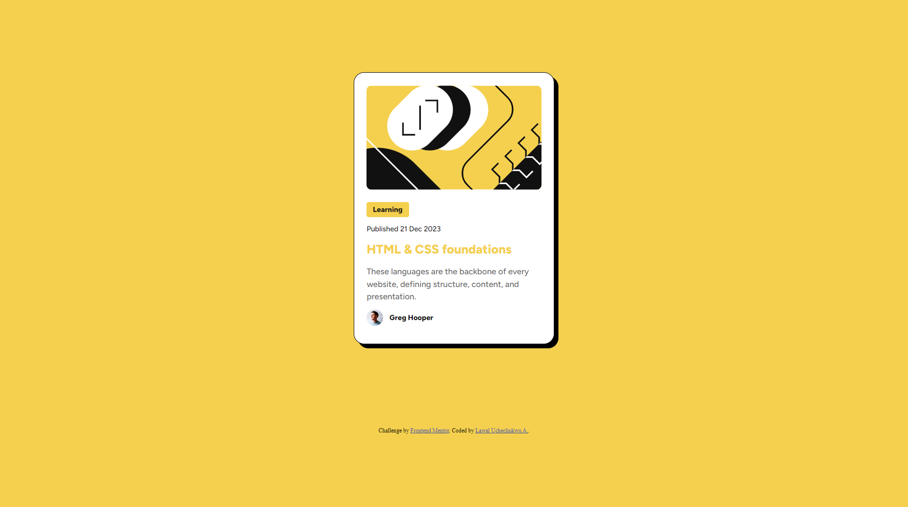

# Frontend Mentor - Blog preview card solution

This is a solution to the [Blog preview card challenge on Frontend Mentor](https://www.frontendmentor.io/challenges/blog-preview-card-ckPaj01IcS). Frontend Mentor challenges help you improve your coding skills by building realistic projects. 

## Table of contents

- [Overview](#overview)
  - [The challenge](#the-challenge)
  - [Screenshot](#screenshot)
  - [Links](#links)
  - [Built with](#built-with)
  - [What I learned](#what-i-learned)
  - [Acknowledgment](#Acknowledgement)
  - [Note](#Note)


## Overview
 This is my second HTML/CSS exercise on Frontend Mentor.

### The challenge

Users should be able to:

- See hover and focus states for all interactive elements on the page

### Screenshot




### Links

- Solution URL: [](https://www.frontendmentor.io/solutions/blog-preview-card-with-cursor-interactability-60M5XR37oI)
- Live Site URL: [](https://emeraldknytt.github.io/blog-preview-card/)

### Built with

- HTML5
- CSS 

### What I learned

In this exercise, I learned how box-shadow works in CSS.


```css
.proud-of-this-css {
  box-shadow: 8px 8px 0 0 #000;
}
```

###  Acknowledgement 

Special thanks to [MatPawluk](https://wwww.frontendmentor.io/profile/MatPawLuk) for the insightful corrections and advice. In response to his suggestions, I have made this changes, and while I could have added under an "Update" section. I am dedicating this section to him. Thanks MatPawLuk!
`changes made`
- Modified `body width` to `100vh` for page responsiveness.
- Changed `description` styling from `id` selector to `class` selector
- Edited `alt attribute` of illustration `svg` file to `illustration-logo`

I would also like to thank [Teodor Jenkler](https://www.frontendmentor.io/profile/TedJenkler) for explaining a few tips that will help improve the readability of my code and accessibilty of my webpage. Adhering to his tips, I made these changes.... Thanks Teodor!

- Used a `main` tag to wrap the content of the profile card instead of `div`
- Got rid of the unnecessary divs I had in my code 
- Learned about `time` element (suggested by Teodor) and used it in my HTML code.


###   Note

There are a few css selectors that have similar property-value pair. Optimise `css` file when you have a chance to do that.